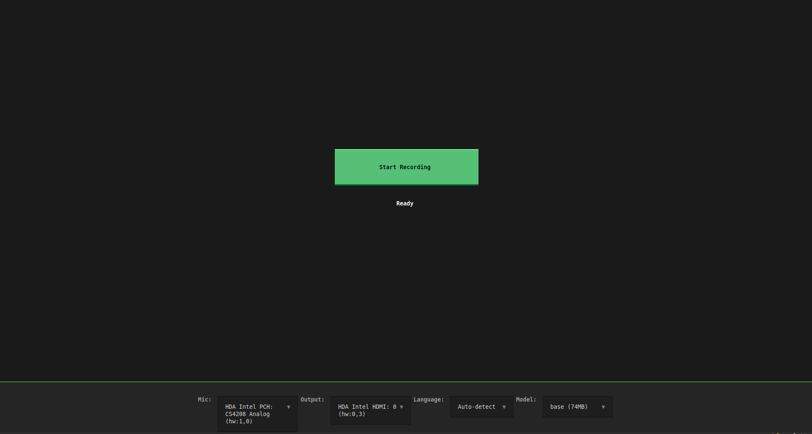

# transkript

Local meeting transcriber for Windows. Records your microphone and system audio (Teams, Zoom, Meet, anything), transcribes it locally with Whisper, and saves a timestamped text file you can paste into any AI tool for summarization.

**No API keys. No internet after setup. No data leaves your machine.**

## Features

- Records **mic + system audio** (WASAPI loopback) simultaneously
- Transcribes locally using **faster-whisper** (4-8x faster than original Whisper)
- Supports **99+ languages** with automatic detection
- Saves timestamped `.txt` files — opens in Notepad by default
- Simple TUI: hit **Start**, hit **Stop**, get your transcript
- Zero cost, zero cloud dependency



---

## Quickest way to get running

If you have **OpenCode**, **Claude Code**, or any AI coding assistant, just paste this into it:

> Download and build https://github.com/Snowiness4394/transkript, run it on my computer and put a shortcut on my desktop

That's it. The AI will handle installing Python, cloning the repo, building the exe, and running it for you.

---

## Build it yourself

Takes about 5 minutes. You'll need Windows 10 or 11.

### Step 1 — Open PowerShell

1. Press the **Windows key** on your keyboard
2. Type `powershell`
3. Click **Windows PowerShell** (the blue one)

### Step 2 — Install Git

Paste this into PowerShell and press Enter:

```powershell
winget install Git.Git
```

When it says "Successfully installed", **close PowerShell and open it again**.

### Step 3 — Install Python

```powershell
winget install Python.Python.3.13
```

**Close PowerShell and open it again** when done.

### Step 4 — Install uv

```powershell
pip install uv
```

### Step 5 — Download the code

```powershell
git clone https://github.com/Snowiness4394/transkript.git
cd transkript
```

### Step 6 — Install dependencies

```powershell
uv sync --group dev
```

### Step 7 — Build the exe

```powershell
build.bat
```

### Step 8 — Run it

When the build finishes, double-click:

```
dist\transkript\transkript.exe
```

Both `transkript.exe` AND the `_internal` folder next to it need to stay together.

---

## Using the app

1. **Select your microphone** from the Mic dropdown at the bottom
2. **Select your speakers** from the Output dropdown
3. Click the big green **Start Recording** button
4. Join your meeting — Teams, Zoom, Google Meet, anything
5. When done, click the red **Stop Recording** button
6. Wait a few seconds for transcription
7. Click **Open File** or **Open Folder** to see your transcript

The transcript looks like this:

```
Meeting Transcript
Date: 2025-06-11 14:30:00
Duration: 00:12:34
Language: English (auto-detected)

[00:00:00] Hello everyone, let's get started.
[00:00:05] I'll go first. Yesterday I finished the API work.
[00:00:12] Great, any blockers?
```

Paste it into ChatGPT, Claude, Gemini, or any AI tool for a summary.

---

## Running from source (without building exe)

```powershell
uv run transkript
```

### CLI options

```powershell
# Use a different Whisper model (tiny/base/small/medium/large-v3)
uv run transkript --model small

# Save transcripts to a different folder
uv run transkript --output C:\Users\Me\MeetingNotes
```

## Model sizes

| Model | Size | Speed | Accuracy | Best for |
|-------|------|-------|----------|----------|
| `tiny` | 39 MB | Fastest | Basic | Quick drafts |
| `base` | 74 MB | Fast | Good | **Default** |
| `small` | 244 MB | Medium | Very good | When accuracy matters |
| `medium` | 769 MB | Slow | Excellent | Important meetings |
| `large-v3` | 1.5 GB | Slowest | Best | Maximum accuracy |

First run downloads the model (~74MB for base). After that it works fully offline.

## Troubleshooting

| Problem | Fix |
|---------|-----|
| `winget` not recognized | Open PowerShell (blue icon), not Command Prompt. |
| `git` not recognized | Close PowerShell and reopen it after installing Git. |
| `uv` not recognized | Close PowerShell and reopen it, or run `pip install uv` again. |
| Antivirus blocks the exe | Windows Defender flags PyInstaller builds. Click "More info" → "Run anyway". |
| No microphone in dropdown | Make sure your mic is plugged in and not used by another app. |
| No loopback device | Enable "Stereo Mix" in Windows Sound settings, or the app will only capture your mic. |

## Keyboard shortcuts

| Key | Action |
|-----|--------|
| Enter | Start/Stop recording |
| q | Quit app |

## Requirements

- Windows 10 or 11
- A microphone
- Speakers or headphones
- ~100MB free disk space

## License

MIT — do whatever you want with it.

## Contributing

Contributions welcome! Open an issue or submit a PR.

## Acknowledgments

- [faster-whisper](https://github.com/SYSTRAN/faster-whisper) — CTranslate2 Whisper implementation
- [Textual](https://github.com/Textualize/textual) — Python TUI framework
- [sounddevice](https://github.com/spatialaudio/python-sounddevice) — Audio capture
